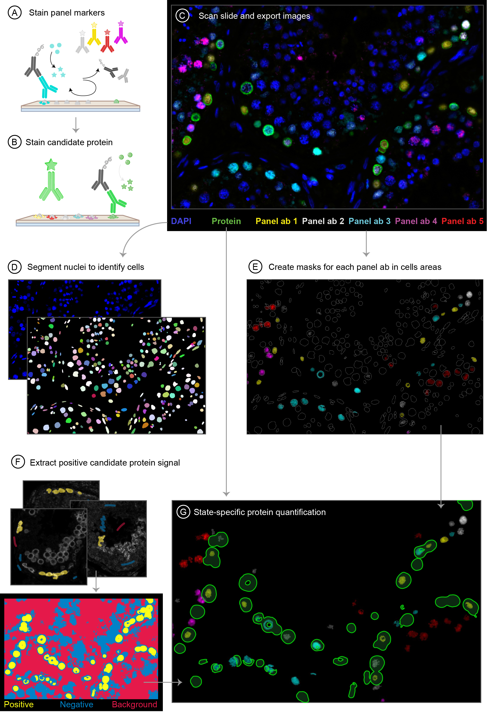

# A spatial single-cell type map of adult human spermatogenesis

## Overview

Spermatogenesis involves the transformation of adult spermatogonial stem cells into fully developed sperm cells, which is governed by the testis niche/microenvironment. The cells must maintain a balance between renewing themselves and becoming differentiated, and then proceed through multiple stages of cellular processes that include mitosis, meiosis, and sperm development, which are accompanied by significant morphological changes in both the shape and size of the cell.

This project aims to create a detailed spatial expression map of proteins involved in spermatogenesis using a multiplex immunohistochemistry approach. In FPPE tissue samples from human testis, specific cellular states along the sperm cell differentiation trajectory are marked out by fluorescent labeling. To be able to quantify and determine the state-specific expression patterns of hundreds of proteins, we will apply an image analysis pipeline to describe which proteins are expressed at which specific stage of spermatogenesis. The image example marks four states of spermatogonia differentiation, and one marker is used to label early spermatocytes. The Laminin beta receptor is mainly expressed during the earliest stages of differentiation of spermatogenesis.

This research has the potential to improve our understanding of the molecular mechanisms that control spermatogenesis, which could lead to the development of new therapies for infertility and other related disorders.

## Installation

Install the [conda](https://conda.io) package, dependency and environment manager.

Then create the `multiplex-analysis` conda environment:

    cd <path to your git repository directory>
    conda env create -f environment.yml

This will install all necessary project dependencies.

## Usage

Copy all project data to the [data](data) directory.

Then run [Jupyter Lab](https://jupyter.org) from within the `multiplex-analysis` conda environment:

    cd <path to your git repository directory>
    conda activate multiplex-analysis
    jupyter-lab

All analysis notebooks can be found in the [notebooks](notebooks) directory.

## Input data

The Transverse histological sections of human testis samples were imaged using 7-color fluorescent multiplex immunohistochemistry (mIHC) to quantify protein expression in spermatogenesis. The stained slides were scanned using the Akoya PhenoImager and multi-page .tiff files are used for the image analysis, where each tiff-page represents a fluorescent channel by this order: 1, DAPI; 2, OPAL480; 3, OPAL520; 4, OPAL570; 5, OPAL620; 6, OPAL690; 7, OPAL780.

## Input parameters

A set of parameters can be updated before running the Jupyter notebooks *pipeline_multiplexed* and *pipeline_multiplexed_batch*, such as, the nuclei growth factor, the parameters of the *StarDist* method, min and max area sizes (to be used to filter particles after segmentation). A detailed description of these parameters can be found in the notebooks

## Output data

## Support

If you find a bug, please [raise an issue](https://github.com/BIIFSweden/CeciliaBergstrm2023-1/issues/new).

## Contact

[SciLifeLab BioImage Informatics Facility (BIIF)](https://www.scilifelab.se/units/bioimage-informatics/) 

*Developed by* Gisele Miranda

## Licence

[MIT](LICENSE)

## DOI